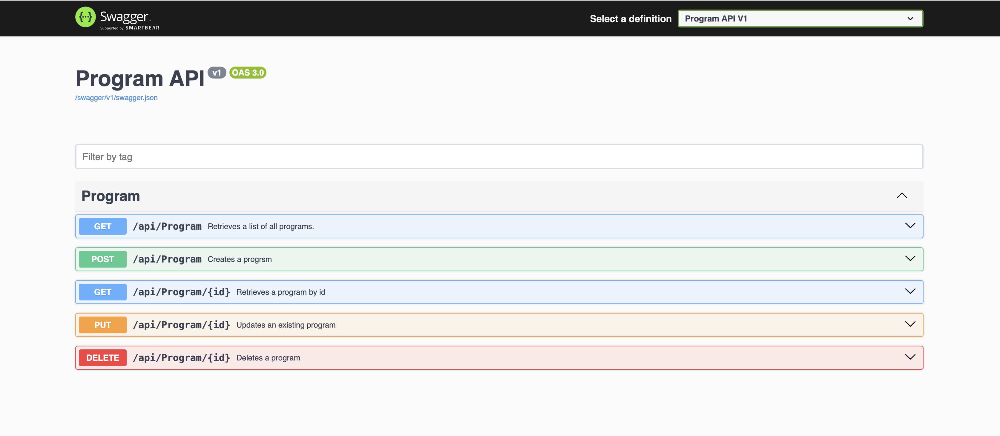

# About Solution

This is a .Net8 API.
Everything was added into just one projects as it's a relatively small project. I added documentation which will show once the app is run

## Screenshot

## How to run

This solution uses Azure CosmosDB to manage data, I used docker to create a local instance for testing. If you have a working Azure CosmosDB connection string you can change what is in appsettings.json or you might need to run the below command to use docker

docker run -d -p 8081:8081 -p 10251:10251 -p 10252:10252 -p 10253:10253 -p 10254:10254 --name=cosmosdb_emulator -e AZURE_COSMOS_EMULATOR_PARTITION_COUNT=1 -e AZURE_COSMOS_EMULATOR_ENABLE_DATA_PERSISTENCE=true mcr.microsoft.com/cosmosdb/linux/azure-cosmos-emulator

Though it seems there's some general issues with using local Azure Cosmos DB as my request while testing was always timing out even when I set timeout to 5 minutes. 

I wasn't really able to test the API because of this but you can go ahead and look at the code implementation though.